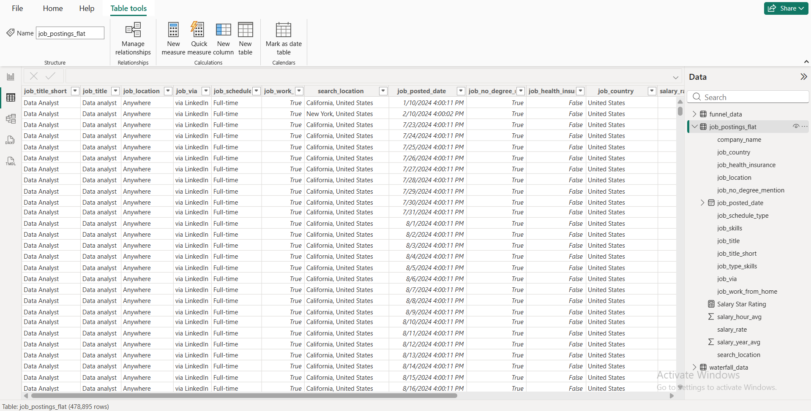

  <h1 align="center">Global Data Jobs Analytics Dashboards</h1>

This project leverages Power BI to ingest, transform, model, and visualize a comprehensive dataset of worldwide tech and data job postings. The end goal is to provide actionable market intelligence on salary benchmarks, top requested skills, geographic distributions, and hiring trends.

##  Key Repository Highlights
*   **End-to-End ETL:** Raw flat file cleaning and transformation using Power Query.
*   **Star Schema Architecture:** Fully optimized relational data model with distinct dimensions and fact tables.
*   **Advanced DAX:** Dynamic metrics for calculations such as median salaries, job percentages, and cross-filtering interactions.
*   **Interactive UI/UX:** Dual-dashboard approach featuring localized drill-through views, map plots, and parameter-driven metrics toggles.

## 📂 Source Dataset
The underlying data contains granular details regarding job postings, salaries, locations, benefit structures, and company metrics. 

*   **Raw Data View:** Can be referenced in **<a href="./Data/">Datasets</a>**

<table align="center">
  <tr>
    <td align="center">
      
       
      <b>Flat Dataset Overview</b>
    </td>
  </tr>
</table>

  <h2 align="center">Data Transformation & ETL (DAX & Power Query)</h2>

* To upgrade the data infrastructure from a single flat sheet to an enterprise-grade data model, several granular transformations were executed via Power Query.
* **Advanced Measure Authoring** : Developed an extensive library of explicit DAX measures for core KPIs, ensuring full calculation control and model performance optimization compared to implicit defaults.
* **Context & Relationship Intelligence** : Utilized DAX evaluation contexts to handle complex data relationships and cross-filtering, ensuring accurate metric calculation across the Star Schema.
* **Dynamic Interactivity** : Implemented Field Parameters through DAX to allow for dynamic axis and measure switching, providing users with high-end analytical flexibility and a tailored reporting experience.

<table border="0">
  <tr>
    <td align="left" valign="top" style="border: none; width: 50%;">
        
      <code>Key Transformations</code> : Standardized job schedule classifications (Full-time, Part-time, Internship), removed null strings, and established unique business keys   
      <code>Dataset</code> : Schedule Dimension
    </td>
    <td align="left" valign="top" style="border: none; width: 50%;">
        
      <code>Key Transformations</code> : Cleansed company structural profiles, isolated landing page URLs, and validated corporate thumbnails   
      <code>Dataset</code> : Company Dimension
    </td>
  </tr>
</table>

<table border="0">
  <tr>
    <td align="left" valign="top" style="border: none; width: 50%;">
        
      <code>Key Transformations</code> : Indexed developer tech stacks, parsed category tags (e.g., programming language), and unified casing   
      <code>Dataset</code> : Skills Dimension
    </td>
    <td align="left" valign="top" style="border: none; width: 50%;">
        
      <code>Key Transformations</code> : Maintained a structured bridge table mapping multi-valued skill groups cleanly back to individual job IDs   
      <code>Dataset</code> : Skills Junction
    </td>
  </tr>
</table>

<table border="0">
  <tr>
    <td align="left" valign="top" style="border: none; width: 50%;">
        
      <code>Key Transformations</code> : Configured conditional columns, recalculated localized adjusted hour/year compensation parameters, and locked transactional grain   
      <code>Dataset</code> : Fact Table
    </td>
  </tr>
</table>

  <h2 align="center">Data Modeling & Architecture</h2>

The repository relies on a clean **Star Schema** centered around the core fact table to maximize DAX calculation efficiency and dashboard performance.

*   **Model Schema View:** Detailed inside,

<table align="center">
  <tr>
    <td align="center">
      
       
      <b>Power BI Model Overview</b>
    </td>
  </tr>
</table>

*   **Relationships:** Core 1-to-Many (`1:*`) mappings connecting `company_dim`, `schedule_dim`, `date_dim`, and `skills_dim` (via `skills_job_dim`) directly to the central `job_posting_fact` records.

  <h2 align="center">Interactive Power BI Dashboards</h2>

###  Analytical Suite 01 : Market Overview & Deep Drill

#### i). Main Interface

* The primary interactive module focuses on industry-wide aggregates, hiring volatility throughout the year, and localized drill-down metrics.

*   **Features:**
    * Displays overall Job Counts (~478.9K), Median Salaries, a localized 2024 hiring trend graph, and structured scatter charts mapping Hourly vs. Yearly benchmarks.

*   **Image Reference:** 

<table align="center">
  <tr>
    <td align="center">
      
       
      <b>Job Dashboard 01</b>
    </td>
  </tr>
</table>

#### ii). Granular Insight Focus

*   **Features:**
    * Automated page routing that isolates specific careers (e.g., *Data Engineer*). Visualizes global geographic maps, WFH/Remote ratios, required degree percentages, and platform distribution profiles.

*   **Image Reference:** 

<table align="center">
  <tr>
    <td align="center">
      
       
      <b>Job Dashboard 01 - Job Title Drill Through</b>
    </td>
  </tr>
</table>

###  Analytical Suite 02 : Specialized Skills & Compensation Vectors
* A secondary high-level executive view crafted to contrast core platform requirements against direct compensation impact.

*   **Features:** 
    *   **KPI Highlight Cards:** Displays global job trends alongside a *Skills Per Job* density metric (averaging 4.8 tools per post).
    *   **Dynamic Visual Toggles:** Slicers allowing immediate adjustments between absolute job count volumes and relative metric percentages.
    *   **Top Skills Breakdown:** Highlights dominant tools (Python, SQL, AWS) mapped against high-paying role salaries (Machine Learning Engineer, Software Engineer).

*   **Image Reference:** 

<table align="center">
  <tr>
    <td align="center">
      
       
      <b>Job Dashboard 02</b>
    </td>
  </tr>
</table>

* Checkout the Complete powerBI Dashboards 
🖥️ **<a href=".//Data Jobs Dashboard.pbix">Dashboard 01</a>**  
🖥️ **<a href="./Data Jobs Dashboard 2.pbix">Dashboard 02</a>**

